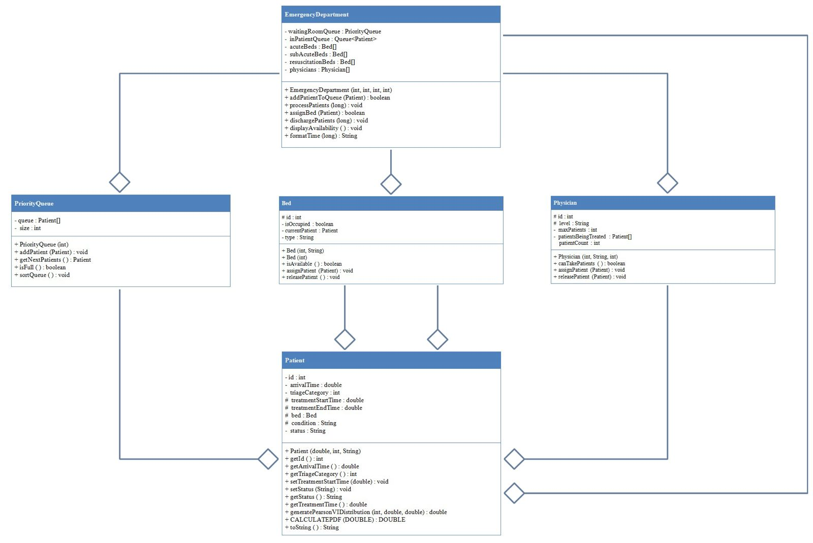
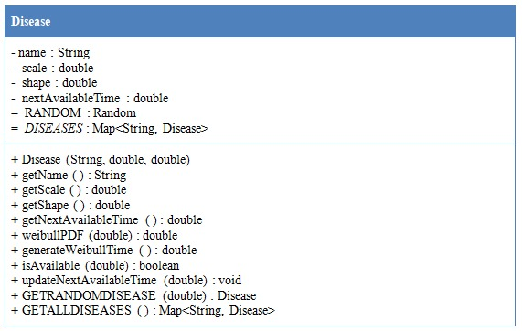
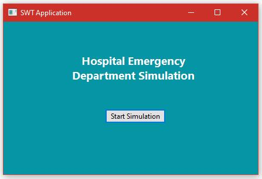
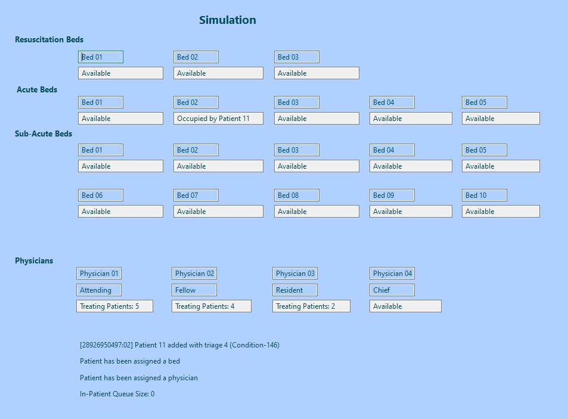
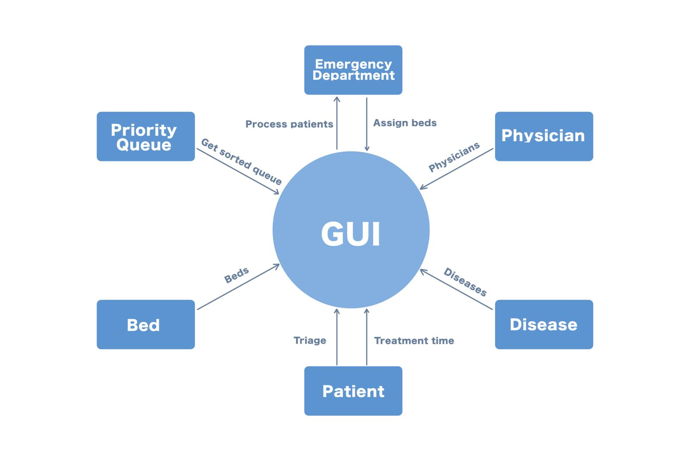

# 🏥 Hospital Emergency Department Simulation

A Java-based simulation of a hospital Emergency Department (ED) using object-oriented principles and real-world-inspired probability distributions. The simulation models patient flow through triage, treatment, and discharge stages while managing resources like beds and physicians efficiently.

---

## 📖 Project Overview

The system simulates the operations of an Emergency Department by modeling:

- Dynamic patient arrivals using probability distributions
- Resource allocation (beds, physicians)
- Priority-based triage
- Treatment processes with time-based progression
- Post-discharge decision times

The simulation uses OOP principles to create scalable and modular classes for patients, diseases, physicians, and beds, integrated through a centralized EmergencyDepartment controller.

---

## 🚀 Features

- 🎯 **Realistic simulation** of patient flow in an ED environment
- 🏷 **OOP-based modular design** (Java)
- ⏱ **Custom probability distributions** for arrival, treatment, and discharge:
  - Weibull Distribution – Patient arrival times
  - Pearson Type VI – Treatment durations
  - Exponential Distribution – Post-discharge decisions
- 📊 **Performance metrics** output: waiting time, resource utilization
- 🩺 **Disease modeling** using triage categories and dynamic severity
- 🔁 **Scalable and extensible** codebase

---

## 🧠 Key Classes

| Class               | Description                                           |
|--------------------|-------------------------------------------------------|
| `Patient`          | Stores ID, arrival time, treatment details            |
| `Bed`              | Tracks occupancy, patient assignment                  |
| `Disease`          | Models disease severity via Weibull distribution      |
| `Physician`        | Handles patient load and treatment responsibilities   |
| `EmergencyDepartment` | Main coordinator: queues, bed assignment, discharge |
| `PriorityQueue`    | Handles triage-based prioritization                   |

---

## 💻 Technologies Used

- **Language:** Java
- **Design:** Object-Oriented Programming (OOP)
- **Statistical Modeling:** Manual implementation using Java math libraries
- **Platform:** Console-based simulation

---

## 📄 Project Report

A full report explaining simulation design, class structure, statistical modeling, implementation details, and results is included:

👉 [Project Report (PDF)](report/project_report.pdf)

---

## 💻 Source Code

All source code files are available in the [`src/htms/`](src/htms/) directory.

---

## 📸 Diagrams

Diagrams illustrate system-level architecture and class hierarchy as well as demonstrate the simulation.

 

 

---

## 👤 Authors
- [Aleeza Rizwan](https://github.com/its-aleezA)
- [Muhammad Ibrahim Abdullah](https://github.com/Ibrahim5570)
- [Muhammad Shaheer Afzal](https://github.com/ShaheerAfzal)

---

## 🔖 License

This project is licensed under the MIT License.
See the [LICENSE](LICENSE) file for full details.
